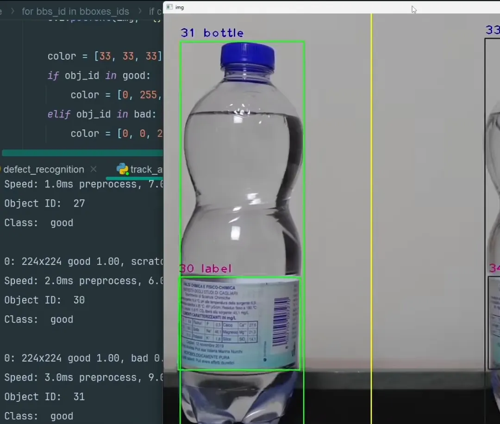

# Product Inspector AI



## 🔍 Overview
Product Inspector AI is an open-source tool designed to analyze and inspect product listings using AI. It helps e-commerce businesses optimize their product descriptions, images, and other key details to improve conversion rates and visibility.

## 🚀 Features
- AI-powered product analysis
- Image and text inspection for optimization
- Open-source and community-driven
- Easy integration with e-commerce platforms

## 📸 Screenshots


## 🛠 Installation
```bash
git clone https://github.com/liveupx/product-inspector-ai.git
cd product-inspector-ai
pip install -r requirements.txt
python app.py
```

## 🤝 Contributing
We welcome contributions! Feel free to open issues and pull requests to improve the project.

## 💖 Support & Sponsorship
Help sustain this project by supporting it on Open Collective:

[](https://opencollective.com/product-inspector-ai)

## 📜 License
This project is licensed under the MIT License. See the [LICENSE](LICENSE) file for details.

## 📬 Contact
For inquiries, open an issue on GitHub or reach out via email.

---

Made with ❤️ by the Open Source Community.
